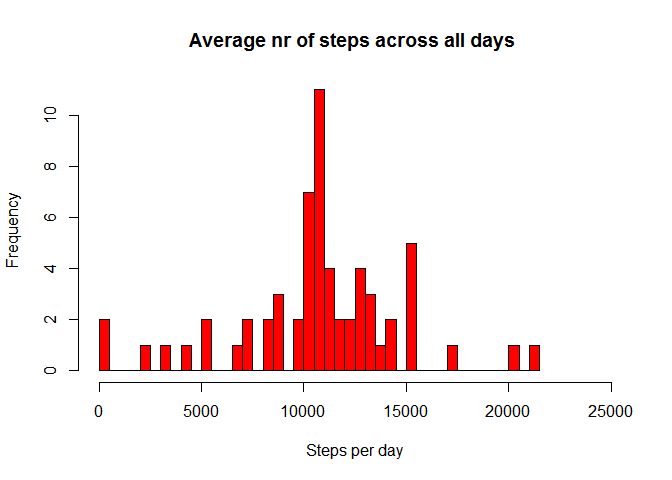

Introduction
------------

It is now possible to collect a large amount of data about personal
movement using activity monitoring devices such as a Fitbit, Nike
Fuelband, or Jawbone Up. These type of devices are part of the
“quantified self” movement – a group of enthusiasts who take
measurements about themselves regularly to improve their health, to find
patterns in their behavior, or because they are tech geeks. But these
data remain under-utilized both because the raw data are hard to obtain
and there is a lack of statistical methods and software for processing
and interpreting the data.

This assignment makes use of data from a personal activity monitoring
device. This device collects data at 5 minute intervals through out the
day. The data consists of two months of data from an anonymous
individual collected during the months of October and November, 2012 and
include the number of steps taken in 5 minute intervals each day.

The data for this assignment can be downloaded from the course web site:

    Dataset: Activity monitoring data [52K]

The variables included in this dataset are:

    steps: Number of steps taking in a 5-minute interval (missing values are coded as NA)
    date: The date on which the measurement was taken in YYYY-MM-DD format
    interval: Identifier for the 5-minute interval in which measurement was taken

The dataset is stored in a comma-separated-value (CSV) file and there
are a total of 17,568 observations in this dataset.

Loading and preprocessing the data
----------------------------------

      # Loading Libraries
        library("ggplot2")

    ## Warning: package 'ggplot2' was built under R version 3.3.2

        library("lubridate")

    ## Warning: package 'lubridate' was built under R version 3.3.2

    # Obtain data and store it in variable ActMonDat
        url <-  "https://d396qusza40orc.cloudfront.net/repdata%2Fdata%2Factivity.zip"
        ActMonDat <-  read.table(unz("activity.zip", "activity.csv"),header = T,  sep = ","
                                 ,colClasses = c("integer", "Date","integer"))

What is mean total number of steps taken per day?
-------------------------------------------------

Missing values are ignored.

      # Calculate total seps taken per day
        StepsDay <-  aggregate(steps ~ date, ActMonDat,  sum)
      
        
      # Create Histogram  
        hist(StepsDay$steps,col="red"
            ,breaks=50
            ,main = "Average nr of steps across all days "
            ,xlab="Steps per day",xlim=c(0,24000)
            )        

        MeanNumberOfSteps<-(mean(StepsDay$steps))

The Mean number of steps is **10766.19**

        MedianNumberOfSteps<-(median(StepsDay$steps))

The Median number of steps is **10765**

What is the average daily activity pattern?
-------------------------------------------

     #time series plot
      avgSteps<- aggregate(x = list(steps = ActMonDat$steps), by = list(interval = ActMonDat$interval), 
                                 FUN = mean, na.rm = TRUE)
      
      ggplot(avgSteps,aes(x=interval,y=steps))+
        scale_x_continuous(name="Interval", breaks=seq(0, 2400, 200)
                           ,minor_breaks =seq(0, 2400, 100),limits=c(0,2400))+
        scale_y_continuous(name="steps",breaks=seq(0, 220, 10)
                           ,minor_breaks =seq(0, 220, 5) )+
        geom_line(aes(colour="red"),size=0.8,na.rm=TRUE)+
        theme(legend.position="none")

Maximum number of steps is on the following interval:

    MaxstepsInterval<-avgSteps[which.max(avgSteps$steps),"interval"]
    MaxstepsAmount<-avgSteps[which.max(avgSteps$steps),"steps"]

The maximum number of steps (i.e. 206.17 ) is on interval **835**

Imputing missing values
-----------------------

Total number of missing values in the dataset (i.e. the total number of
rows with NAs)

        MissingNum<-length(which(is.na(ActMonDat$steps)))

In total there are **2304** observations with missing values.

      # Determine Average nr of steps per interval
        avgSteps<-mean(ActMonDat$steps,na.rm=TRUE)

      # Create ActMonDat2 by first copy ActMonDat and then replace NA values by the Average amount of steps
        ActMonDat2<-ActMonDat
        
        x<-1
        while (x<=nrow(ActMonDat))
        {
          Steps<-ActMonDat[x,"steps"]
          ActMonDat2[x,"steps"]<-ifelse(is.na(Steps),avgSteps,Steps)
          x<-x+1
        }

Make a histogram of the total number of steps taken each day and
Calculate and report the mean and median total number of steps taken per
day. Do these values differ from the estimates from the first part of
the assignment? What is the impact of imputing missing data on the
estimates of the total daily number of steps?

      # Calculate total steps taken per day
        StepsDay2 <-  aggregate(steps ~ date, ActMonDat2,  sum)

      # Create Histogram  
        hist(StepsDay2$steps,col="red"
            ,breaks=50
            ,main = "Average nr of steps across all days "
            ,xlab="Steps per day",xlim=c(0,25000)
            )        

Mean number of steps

        MeanNumberOfSteps2<-mean(StepsDay2$steps)

The Mean number of steps is **10766.19**

Median Number of steps

        MedianNumberOfSteps2<-median(StepsDay2$steps)

The Median number of steps is **10766.19**

The impact of imputing missing data on the estimates of the total daily
number of steps is that the mean remains the same while the median
changes from **10765** to **10766.19** and becomes equal to the Mean.

Are there differences in activity patterns between weekdays and weekends?
-------------------------------------------------------------------------

    # Create factor indicatin Weekend or Weekday
          ActMonDat$WeekDay<-ifelse(wday(ActMonDat$date) %in% c(7,1)==TRUE,"Weekend" ,"Weekday")
          
          # Summary of mean steps for weekends
          avgStepsWeekEnd<-with(ActMonDat[ActMonDat[,"WeekDay"]=="Weekend",]
               ,aggregate(x = list(steps = steps)
                          , by = list(interval = interval)
                          , FUN = mean, na.rm = TRUE))
          
          # Summary of mean steps for weekdays
          avgStepsWeekday<-with(ActMonDat[ActMonDat[,"WeekDay"]=="Weekday",]
                                ,aggregate(x = list(steps = steps)
                                           , by = list(interval = interval)
                                           , FUN = mean, na.rm = TRUE))
          
         
         
          par(mfrow = c(2, 1))

    plot(avgStepsWeekday, type = "l", col = "green", main = "Weekdays",lwd=2)
    plot(avgStepsWeekEnd, type = "l", col = "blue", main = "Weekends",lwd=2)

    par(mfrow = c(1, 1))

The comparison of both graps shows that there are differences in Weekday
activities and Weenend activities.
